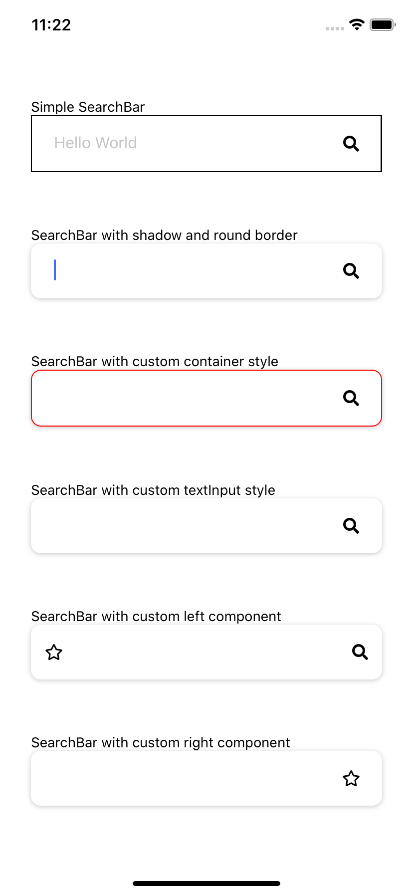

# React-Native-custom-components

React-native-custom-components compatible for both ios and android

# List of components
- [SearchBar](#searchBar)
- [Avatar](#avatar)
- [Button](#button)

## SearchBar 

#### Preview:



#### Usage:

```
<SearchBar
    shadow
    round={10}
    leftComponent={<Icon name="star" size={16} color={"black"} />}
    onChangeText={() => { }} />
```

#### Property

| Property             |    Type    |       Default        | Description                                        |
| -------------------- | :--------: | :------------------: | -------------------------------------------------- |
| shadow  |   boolean   |  false     | use to apply shadow effect on the SearchBar container         
| round   |   number    |  10        | use to change border radius of the SearchBar container         
| placeholder  |   string   |  ""    | use to add placeholder to the SearchBar        
| onChangeText  |   functioj   |  required     | use to update search bar input     
| shadow  |   boolean   |  false     | use to apply shadow effect on the SearchBar container         
| containerStyle  |   object   |  detail in source code     | use to style SearchBar container
| textInputStyle  |   object   | detail in source code     | use to style Search input 
| leftComponent  |   object   |  null     | use to add custom component on the left of the search bar
| rightComponent  |   object   |  vector search icon     | use to add custom component on the right of the search bar

## Avatar

#### Preview:


#### Usage:

```
<Avatar 
    image={require("../assets/images/child-1837375_960_720.png")} 
    width={200} 
    height={200}/>
```

#### Property

| Property             |    Type    |       Default        | Description                                        |
| -------------------- | :--------: | :------------------: | -------------------------------------------------- |
| width  |   number   |  100     | use to set width of the avatar
| height |   number   |  100     | use to set height of the avatar
| image  |   string   |  required     | image in avatar


## Button

#### Preview:


#### Usage:

```
<Button round={30} shadow gradient={["#11998e", "#38ef7d"]} color={"#38ef7d"}>
    <Text style={{ color: "white", fontWeight: '900' }}>Hello World</Text>
</Button>
```

#### Property

Coming Soon

    
    